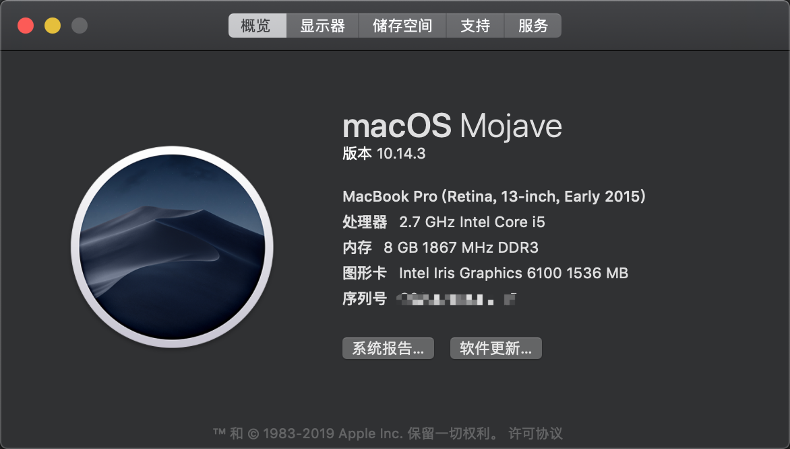
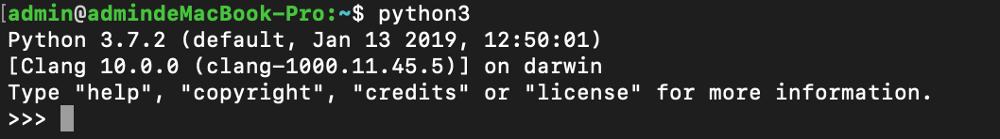
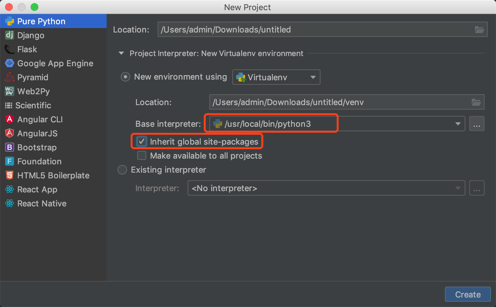
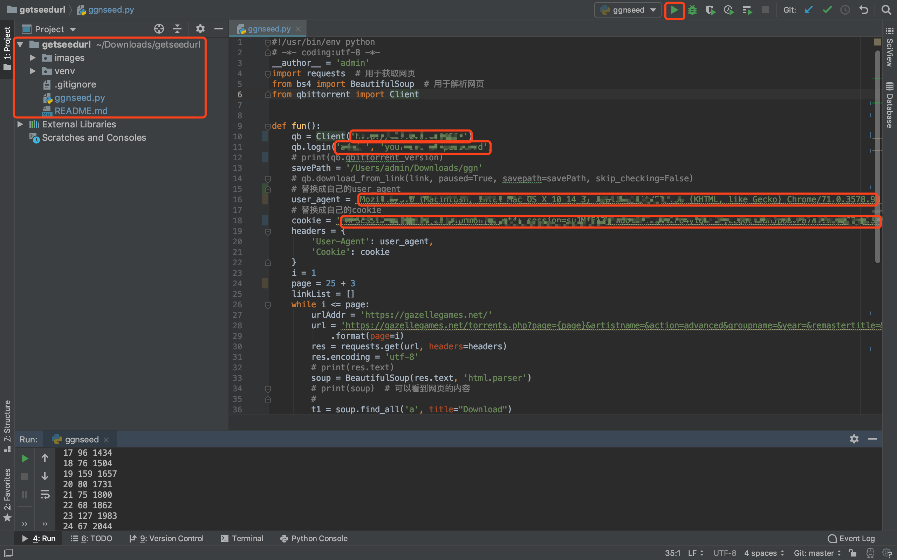
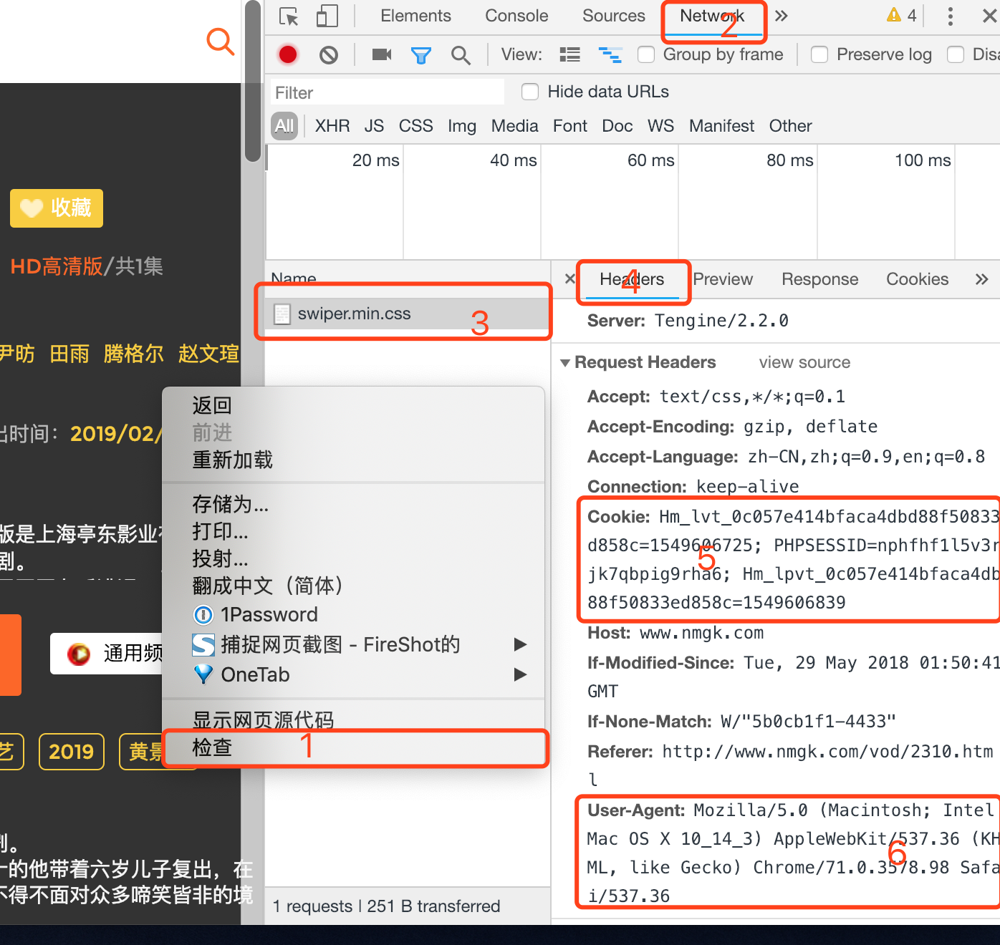

# 使用指南










2100小种子，总体积60M这样，主程序需要填自己的Cookie和User-Agent，如果报错




# .DS_Store banished!

```shell
echo .DS_Store >> .gitignore
```
# pycharm、python3
# 完成ggn2000种子下载任务

- https://github.com/qbittorrent/qBittorrent/wiki/WebUI-API-Documentation-(qBittorrent-v3.1.x))

  